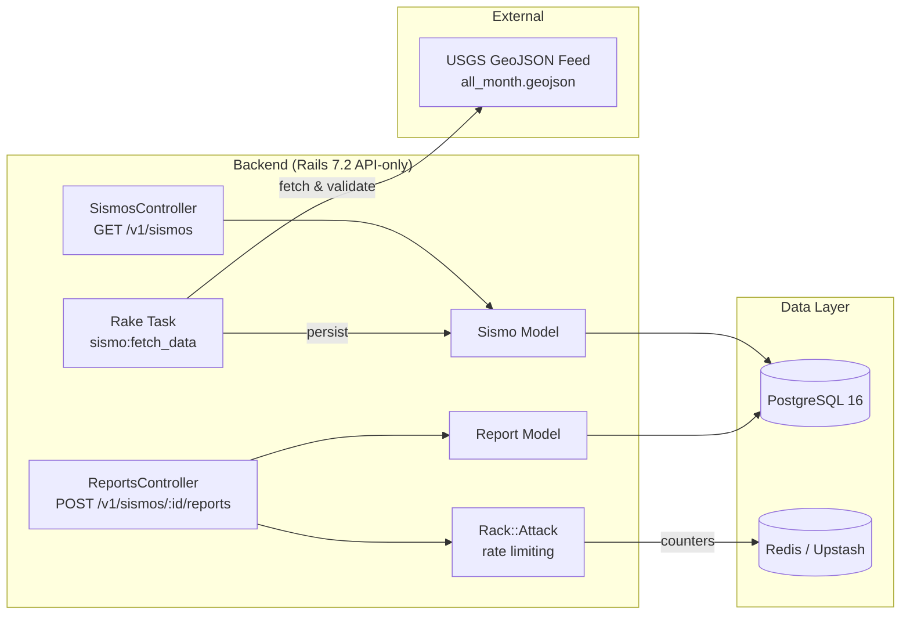

# Telurify API

The Rails backend API service for **Telurify**, a platform that collects, processes, and exposes worldwide seismic activity data from the [USGS Earthquake Hazards Program](https://earthquake.usgs.gov/). Events are collected via a background rake task, exposed through a JSON API, and allow users to submit structured "Did You Feel It?" intensity reports.

> **Note:** The frontend application lives in a separate repository (`telurify-web`), built with Astro and React islands.

---

## Architecture



**Component responsibilities:**

| Layer | Responsibility |
|---|---|
| **Backend API** | Serves paginated, filterable seismic events in a JSON:API-style format and accepts structured intensity reports for events. |
| **Rake task** | Pulls the USGS "Past 30 days" GeoJSON feed, validates ranges (magnitude, latitude, longitude), skips duplicates, and persists records. |
| **Rack::Attack** | Rate-limits all requests by IP (60 req/min) and throttles the reports endpoint specifically (5 req/min) to prevent spam on a public, unauthenticated endpoint. |
| **PostgreSQL** | Stores `sismos` (events) and `reports`. |
| **Redis (Upstash)** | Backs `rack-attack`'s distributed rate-limit counters in production. |

---

## Tech Stack

**Backend**
- Ruby 3.4.10 / Rails 7.2.3 (API-only mode)
- PostgreSQL 16
- `httparty` (USGS feed), `will_paginate`, `rack-cors`
- `rack-attack` + `redis` (rate limiting, backed by Upstash in production)
- Linting/security: `rubocop`, `brakeman`, `bundler-audit`

**Infrastructure**
- Docker Compose (dev environment: `db`, `backend`)
- Makefile as the single entry point for all workflows
- GitHub Actions CI (tests + linting/security)
- Render (API hosting) + Neon (PostgreSQL) + Upstash (Redis) in production

---

## Getting Started

### Prerequisites

Only **Docker** and **Make** are required — no local Ruby or PostgreSQL installation needed. All dependencies run inside containers, and the source code is bind-mounted so changes inside containers (e.g., `Gemfile.lock`) are reflected in your local directory.

### First-time setup

```bash
make dev-setup
```

This single command will:
1. Build the dev Docker images
2. Start PostgreSQL and wait for it to be healthy
3. Create the databases and run migrations
4. Start all backend services (`db`, `backend`)

> **Note on Redis:** no local Redis is required for development. `rack-attack` falls back to an in-memory store automatically when `REDIS_URL` / `RACK_ATTACK_REDIS_URL` are unset.

### Load seismic data

Fetch the latest 30 days of events from USGS into the database:

```bash
docker compose exec backend bin/rails sismo:fetch_data
```

The task reports how many records were created, skipped as duplicates, and rejected by validation.

### Access the apps

| App | URL |
|---|---|
| Backend API | http://localhost:3000/v1/sismos |

---

## Usage

### Makefile commands

| Command | Description |
|---|---|
| `make dev-setup` | Full setup: build images, create DB, run migrations, start all services |
| `make dev-up` | Start the dev environment |
| `make dev-down` | Stop the dev environment (keeps DB volume) |
| `make dev-down-clean` | Stop containers **and** remove volumes (fresh start) |
| `make dev-build` | Rebuild Docker images (needed after changing the Gemfile) |
| `make dev-install` | Install/update dependencies inside the containers |
| `make dev-shell-backend` | Open a shell in the backend container |

### Updating dependencies

Dependencies are updated **inside** the container; lockfiles are updated on your host via bind mounts:

```bash
make dev-shell-backend
bundle update           # or: bundle update <gem>
# Gemfile.lock on your host is now updated
```

### API Endpoints

**List seismic events**

```
GET /v1/sismos
```

Query parameters:

| Param | Description |
|---|---|
| `page` | Page number (default: 1) |
| `per_page` | Items per page (max: 1000) |
| `filters[mag_type]` | Comma-separated magnitude types: `md`, `ml`, `ms`, `mw`, `me`, `mi`, `mb`, `mlg` |

```bash
curl 'http://localhost:3000/v1/sismos?page=1&per_page=10&filters[mag_type]=mw,ml'
```

Response:

```json
{
  "data": [
    {
      "id": 1,
      "type": "feature",
      "attributes": {
        "external_id": "ci40664762",
        "magnitude": 0.93,
        "place": "10 km N of Banning, CA",
        "time": "2026-08-01 17:43:53 UTC",
        "tsunami": false,
        "mag_type": "ml",
        "title": "M 0.9 - 10 km N of Banning, CA",
        "coordinates": {
          "longitude": -116.85,
          "latitude": 34.01
        }
      },
      "links": {
        "external_url": "https://earthquake.usgs.gov/earthquakes/eventpage/ci40664762"
      }
    }
  ],
  "pagination": {
    "current_page": 1,
    "total": 12847,
    "per_page": 10
  }
}
```

**Submit an intensity report for an event**

```
POST /v1/sismos/:sismo_id/reports
```

```bash
curl -X POST 'http://localhost:3000/v1/sismos/1/reports' \
  -H 'Content-Type: application/json' \
  -d '{"felt": true, "intensity": "moderate"}'
```

- `201 Created` — report persisted (`felt`: boolean, `intensity`: one of `not_felt`, `weak`, `light`, `moderate`, `strong`, `severe`)
- `422 Unprocessable Entity` — validation failed
- `404 Not Found` — the referenced event does not exist
- `429 Too Many Requests` — rate limit exceeded (see [Rate Limiting](#rate-limiting))

---

## Rate Limiting

Public write endpoints are protected against abuse via [`rack-attack`](https://github.com/rack/rack-attack), backed by Redis for distributed counters:

| Rule | Limit | Scope |
|---|---|---|
| Global | 60 requests/minute | Per IP, all endpoints except `/assets` |
| Reports | 5 requests/minute | Per IP, `POST /v1/sismos/:id/reports` only |

Exceeding a limit returns `429 Too Many Requests` with a `Retry-After` header and a JSON error body:

```json
{ "error": "Rate limit exceeded. Try again in 42 seconds." }
```

### Configuration

Set one of these environment variables to a Redis connection string:

| Variable | Description |
|---|---|
| `REDIS_URL` | Standard Redis connection string |
| `RACK_ATTACK_REDIS_URL` | Takes precedence if set — use this to point rate limiting at a different Redis instance than other Redis usage |

In production, this points to an [Upstash](https://upstash.com/) Redis instance (free tier). **`REDIS_URL` (or `RACK_ATTACK_REDIS_URL`) is required in production** — the app raises on boot if neither is set and `RAILS_ENV=production`.

In development, if neither variable is set, rate limiting falls back to an in-memory store (no Redis needed locally).

---

## Testing & Linting

```bash
# Run the test suite
docker compose exec backend bin/rails test

# Lint & security checks (same as CI)
docker compose exec backend bin/rubocop --parallel
docker compose exec backend bin/brakeman -q -w2
docker compose exec backend bin/bundler-audit
```

The GitHub Actions workflow (`.github/workflows/ci.yml`) runs the test suite and all three linting/security checks on every push and pull request to `main`.

---

## License

This project is released under the [MIT License](LICENSE).
