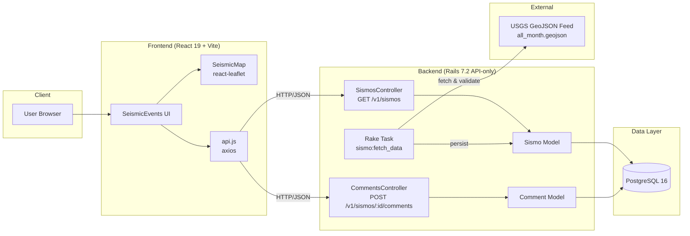

# Seismic Events Explorer

A full-stack application that fetches, stores, and visualizes worldwide seismic activity data from the [USGS Earthquake Hazards Program](https://earthquake.usgs.gov/). Events are collected via a background rake task, exposed through a REST API, and explored through an interactive web interface with map visualization, filtering, pagination, and per-event comments.

> **Note:** This project is planned to be split into two separate repositories — one for the backend API and one for the frontend — so each can evolve with its own release cycle, deployment pipeline, and free-tier hosting strategy, without cross-cutting responsibilities.

---

## Architecture



**Component responsibilities:**

| Layer | Responsibility |
|---|---|
| **Frontend** | Interactive UI: filter events by date range and magnitude type, render them on a Leaflet map (color-coded by magnitude), paginate results, and post comments per event. |
| **Backend API** | Serves paginated, filterable seismic events in a JSON:API-style format and persists comments associated with events. |
| **Rake task** | Pulls the USGS "Past 30 days" GeoJSON feed, validates ranges (magnitude, latitude, longitude), skips duplicates, and persists records. |
| **PostgreSQL** | Stores `sismos` (events) and `comments`. |

---

## Tech Stack

**Backend**
- Ruby 3.4.10 / Rails 7.2.3 (API-only mode)
- PostgreSQL 16
- `httparty` (USGS feed), `will_paginate`, `rack-cors`
- Linting/security: `rubocop`, `brakeman`, `bundler-audit`

**Frontend**
- React 19 + Vite 6
- Material UI 7
- Leaflet / react-leaflet 5 (OpenStreetMap tiles)
- axios

**Infrastructure**
- Docker Compose (dev environment: `db`, `backend`, `frontend`)
- Makefile as the single entry point for all workflows
- GitHub Actions CI (tests + linting/security)

---

## Getting Started

### Prerequisites

Only **Docker** and **Make** are required — no local Ruby, Node, or PostgreSQL installation needed. All dependencies run inside containers, and the source code is bind-mounted so changes inside containers (e.g., `Gemfile.lock`, `package-lock.json`) are reflected in your local directory.

### First-time setup

```bash
make dev-setup
```

This single command will:
1. Build the dev Docker images
2. Start PostgreSQL and wait for it to be healthy
3. Create the databases and run migrations
4. Start all services (`db`, `backend`, `frontend`)

### Load seismic data

Fetch the latest 30 days of events from USGS into the database:

```bash
docker compose exec backend bin/rails sismo:fetch_data
```

The task reports how many records were created, skipped as duplicates, and rejected by validation.

### Access the apps

| App | URL |
|---|---|
| Frontend | http://localhost:5173 |
| Backend API | http://localhost:3000/v1/sismos |

---

## Usage

### Makefile commands

| Command | Description |
|---|---|
| `make dev-setup` | Full setup: build images, create DB, run migrations, start all services |
| `make dev-up` | Start the dev environment |
| `make dev-down` | Stop the dev environment (keeps DB volume) |
| `make dev-down-clean` | Stop containers **and** remove volumes (fresh start) |
| `make dev-build` | Rebuild Docker images (needed after changing the Gemfile) |
| `make dev-install` | Install/update dependencies inside the containers |
| `make dev-shell-backend` | Open a shell in the backend container |
| `make dev-shell-frontend` | Open a shell in the frontend container |

### Updating dependencies

Dependencies are updated **inside** the containers; lockfiles are updated on your host via bind mounts:

```bash
# Backend
make dev-shell-backend
bundle update           # or: bundle update <gem>
# Gemfile.lock on your host is now updated

# Frontend
make dev-shell-frontend
npm update              # or: npm install <pkg>@latest --legacy-peer-deps
# package-lock.json on your host is now updated
```

### API Endpoints

**List seismic events**

```
GET /v1/sismos
```

Query parameters:

| Param | Description |
|---|---|
| `page` | Page number (default: 1) |
| `per_page` | Items per page (max: 1000) |
| `filters[mag_type]` | Comma-separated magnitude types: `md`, `ml`, `ms`, `mw`, `me`, `mi`, `mb`, `mlg` |

```bash
curl 'http://localhost:3000/v1/sismos?page=1&per_page=10&filters[mag_type]=mw,ml'
```

Response:

```json
{
  "data": [
    {
      "id": 1,
      "type": "feature",
      "attributes": {
        "external_id": "ci40664762",
        "magnitude": 0.93,
        "place": "10 km N of Banning, CA",
        "time": "2026-08-01 17:43:53 UTC",
        "tsunami": false,
        "mag_type": "ml",
        "title": "M 0.9 - 10 km N of Banning, CA",
        "coordinates": {
          "longitude": -116.85,
          "latitude": 34.01
        }
      },
      "links": {
        "external_url": "https://earthquake.usgs.gov/earthquakes/eventpage/ci40664762"
      }
    }
  ],
  "pagination": {
    "current_page": 1,
    "total": 12847,
    "per_page": 10
  }
}
```

**Create a comment on an event**

```
POST /v1/sismos/:sismo_id/comments
```

```bash
curl -X POST 'http://localhost:3000/v1/sismos/1/comments' \
  -H 'Content-Type: application/json' \
  -d '{"body": "Felt this one downtown."}'
```

- `201 Created` — comment persisted (body must be non-empty)
- `422 Unprocessable Entity` — validation failed
- `404 Not Found` — the referenced event does not exist

---

## Testing & Linting

```bash
# Run the test suite
docker compose exec backend bin/rails test

# Lint & security checks (same as CI)
docker compose exec backend bin/rubocop --parallel
docker compose exec backend bin/brakeman -q -w2
docker compose exec backend bin/bundler-audit
```

The GitHub Actions workflow (`.github/workflows/ci.yml`) runs the test suite and all three linting/security checks on every push and pull request to `main`.

---

## Roadmap

- **Repository split**: the monorepo will be segmented into two repositories — `seismic-api` (Rails backend) and `seismic-web` (React frontend) — enabling independent deployments on free-tier services and clearer ownership of each stack.
- Upgrade path to Rails 8.x (currently on 7.2; see `Backend/config/brakeman.ignore`).

---

## License

This project is released under the [MIT License](LICENSE).
